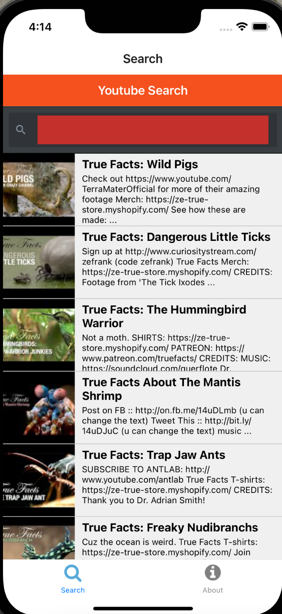

# Hack Technology / Project Attempted

## What you built? 
I followed the CS52 youtube search app assignment to learn how to set up an iOS development environment and how to use react native. 

Search page!

## Who Did What?
I worked on everything! 

## What you learned
React native, how to set up an iOS development environment, using and signing up for the Youtube API. Also learned that the version of node that I had on my computer was extremely old and out of date and had to think about optimizing the development environment on my computer. 

## Authors
Edie Wilson

## Acknowledgments
[CS52 React Native tutorial!](https://cs52.me/assignments/sa/react-native/)